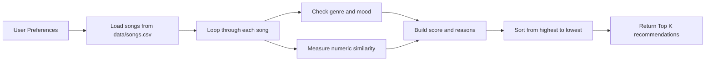
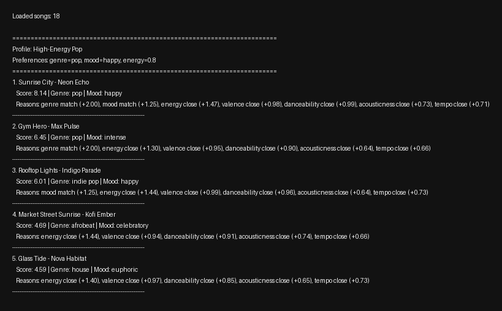
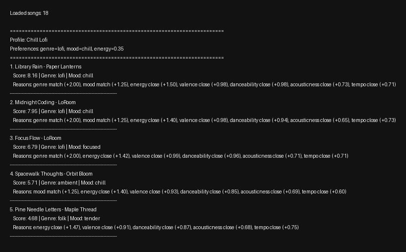
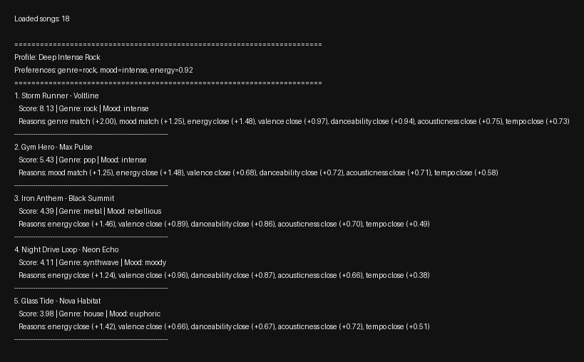
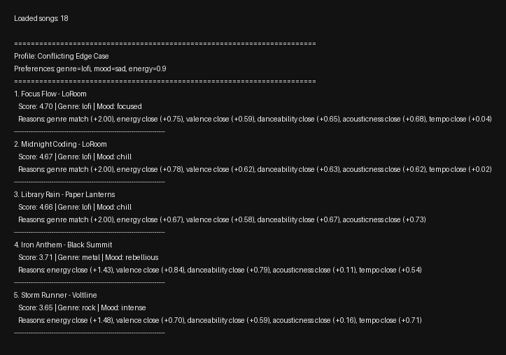
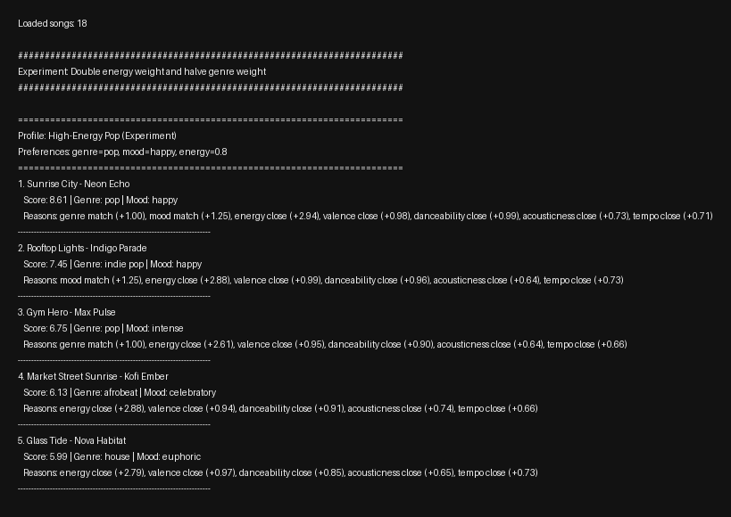

# 🎵 Music Recommender Simulation

## Project Summary

This project builds a small CLI-first music recommender that compares a user taste profile to songs in a CSV catalog and ranks the closest matches. My version uses genre, mood, and multiple numeric audio-style features so the recommendations feel more explainable than a simple random playlist, and I also added a very simple optional desktop UI as an extension.

---


## How The System Works

Real platforms like Spotify, YouTube, and TikTok usually combine **collaborative filtering** and **content-based filtering**. Collaborative filtering looks at behavior patterns like likes, skips, replays, playlists, watch time, and what similar users enjoyed. Content-based filtering looks at the item's own attributes, such as genre, mood, tempo, energy, or other audio features.

This simulation focuses on a simple **content-based filtering approach**. Instead of learning from other users, it compares each song's features to a user's preferences and recommends songs that are most similar in style and feel.

### 🎵 Song Features
Each `Song` in the system includes:

- `energy` - intensity of the track  
- `valence` - how positive or negative the song sounds  
- `danceability` - how suitable the song is for dancing  
- `acousticness` - whether the song is more acoustic or electronic  
- `tempo_bpm` - speed of the song  
- `genre` - type of music (for example pop, rock, or lofi)  
- `mood` - overall emotional tone (for example happy, chill, or intense)  

I expanded the dataset from 10 songs to 18 songs by adding `classical`, `reggaeton`, `country`, `metal`, `afrobeat`, `blues`, `house`, and `folk`, plus new moods like `serene`, `fiery`, `nostalgic`, `rebellious`, `celebratory`, `soulful`, `euphoric`, and `tender`.

Future features I would add to deepen the simulation:

- `instrumentalness`
- `speechiness`
- `liveness`
- `loudness`
- `release_year` or `recency_score`

---

### 👤 UserProfile
The main taste profile for the starter simulation uses these target values:

- `genre = "pop"`  
- `mood = "happy"`  
- `energy = 0.80`  
- `valence = 0.82`  
- `danceability = 0.78`  
- `acousticness = 0.20`  
- `tempo_bpm = 122`  

This profile is narrow enough to clearly prefer upbeat pop songs, but still flexible enough to distinguish between something like intense rock and chill lofi by using multiple features instead of genre alone.

---

### 🧠 Scoring Logic
The recommender computes a score for each song using this weighted recipe:

- `+2.0` points for a **genre** match  
- `+1.25` points for a **mood** match  
- up to `+1.5` points for **energy** similarity  
- up to `+1.0` point for **valence** similarity  
- up to `+1.0` point for **danceability** similarity  
- up to `+0.75` points for **acousticness** similarity  
- up to `+0.75` points for **tempo_bpm** similarity  

For numerical features, the system measures how close the song is to the user's target value. Closer values receive more points, which means songs can still score well even without an exact match.

---

### 🎯 Recommendation Selection
- The system loads every song from `data/songs.csv`  
- It calculates a score and explanation for every song  
- Songs are ranked from highest to lowest score  
- The top `k` songs are returned as recommendations  

---

### 🔁 Simple Flow

User Preferences -> Compare with Song Features -> Compute Scores -> Rank Songs -> Recommend Top Results



Potential bias note: This system might over-prioritize genre, ignoring songs that match the user's mood and numeric preferences but come from a different genre label.

---

## Getting Started

### Setup

1. Create a virtual environment (optional but recommended):

   ```bash
   python -m venv .venv
   source .venv/bin/activate      # Mac or Linux
   .venv\Scripts\activate         # Windows
   ```

2. Install dependencies

```bash
pip install -r requirements.txt
```

3. Run the CLI version:

```bash
python -m src.main
```

4. Optional extension: run the simple desktop UI:

```bash
python -m src.ui
```

### Using the App

If you open the desktop UI with `python -m src.ui`, use it like this:

1. Pick a `Genre` and `Mood` from the dropdown menus
2. Adjust the sliders for `Energy`, `Valence`, `Danceability`, and `Acousticness`
3. Set your preferred `Tempo BPM` and how many results you want in `Top K`
4. Click `Get Recommendations` to rank the songs
5. Read the result panel to see each song's title, score, and explanation
6. Click `Reset to Pop Profile` to return to the default upbeat pop settings

The UI uses the same scoring logic as the CLI, so both versions should return the same recommendations for the same profile.

### Running Tests

Run the tests with:

```bash
pytest
```

Extra edge-case checks I added cover CSV parsing, ranking order, and behavior when `k` is zero or larger than the catalog.

If a global pytest plugin interferes on your machine, this repo-specific fallback command works too:

```bash
PYTHONPATH=. PYTEST_DISABLE_PLUGIN_AUTOLOAD=1 pytest -p no:cacheprovider
```

---

## Experiments You Tried

- **High-Energy Pop:** `Sunrise City` ranked first, followed by `Gym Hero` and `Rooftop Lights`. This felt right because the profile strongly favored upbeat, high-energy, positive songs.
- **Chill Lofi:** `Library Rain`, `Midnight Coding`, and `Focus Flow` rose to the top. This made sense because they matched the lofi genre, chill mood, lower energy, and higher acousticness targets.
- **Deep Intense Rock:** `Storm Runner` ranked first by a wide margin. It matched both the rock/intense labels and landed very close on the energy and tempo targets.
- **Conflicting Edge Case:** lofi songs still ranked well even though the requested mood did not exist in the data. This revealed that the genre weight can overpower other missing preferences.
- **Weight Shift Experiment:** After doubling energy and halving genre, `Rooftop Lights` moved above `Gym Hero` for the pop profile. That change made the system more flexible and less genre-dominated.

### CLI Output Snapshots











---

## Limitations and Risks

- The catalog is still tiny, so some genres and moods only have one representative song
- Genre has a strong fixed weight, which can create a filter bubble
- The system does not use lyrics, artist familiarity, or listening history
- Numeric closeness can sometimes reward a song that matches the math better than the real listening vibe

You will go deeper on this in the model card.

---

## Reflection

I learned that a recommender can feel surprisingly personal even when the logic is just a weighted scoring formula. Once taste is translated into features like genre, mood, and energy, the system can produce results that make intuitive sense, but only if the dataset is varied enough and the weights are balanced carefully.

I also learned how easy it is for bias to appear in a simple system. A small catalog or an oversized genre bonus can make the same kinds of songs keep floating to the top, which is a good reminder that even transparent recommenders still reflect the choices made by the person designing them.

The full write-up is in [model_card.md](model_card.md).
